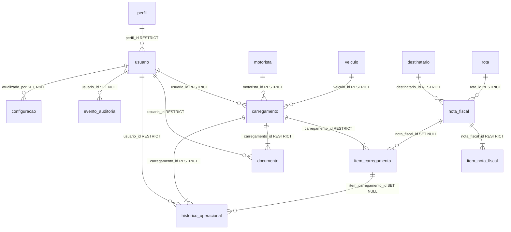

# M0.5 — Modelo de Domínio Consolidado

Documento base para as fases M1 em diante da migração JSON → PostgreSQL.

**Escopo:** apenas modelagem estrutural. Nenhum dado migrado. Nenhuma regra de negócio alterada. Backend ativo permanece `JSON`.

---

## 1. Modelo final do domínio

O domínio operacional do sistema Minuta de Carregamento compreende **14 tabelas** organizadas em quatro grupos:

| Grupo | Tabelas | Finalidade |
|-------|---------|------------|
| **Identidade e acesso** | `perfil`, `usuario` | Autenticação e autorização |
| **Cadastros operacionais** | `motorista`, `veiculo`, `destinatario`, `rota` | Referências reutilizáveis com soft delete |
| **Operação fiscal e logística** | `nota_fiscal`, `item_nota_fiscal`, `carregamento`, `item_carregamento` | XMLs processados e carregamentos |
| **Artefatos e governança** | `documento`, `historico_operacional`, `evento_auditoria`, `configuracao` | PDFs em disco, histórico imutável, auditoria transversal e parâmetros |

### Entidades deliberadamente **não** criadas nesta fase

| Conceito atual (JSON) | Decisão | Justificativa |
|----------------------|---------|---------------|
| `separacao.json` | Adiar para M3+ | Estado operacional transitório complexo; requer análise do fluxo de separação |
| `lotes.json` | Adiar para M3+ | Vinculado ao módulo de separação |
| `classificacao_produtos.json` | `configuracao` (tipo JSON) | Parâmetro permanente, não entidade relacional |
| Excel | Não modelar | Existe apenas durante a operação corrente (session state) |

---

## 2. Entidades revisadas

### `perfil`
- Catálogo de perfis (`ADMIN`, `OPERADOR`).
- Seed obrigatório na primeira migration de schema.

### `usuario`
- FK `perfil_id` → `perfil.id` (RESTRICT).
- Campo `perfil` denormalizado para compatibilidade com JSON legado.
- Soft delete: `ativo` + `excluido_em`.
- UNIQUE `usuario` (login).
- Campos: `bloqueado`, `ultimo_login`, timestamps.

### `motorista`, `veiculo`, `destinatario`, `rota`
- Soft delete padronizado (`ativo`, `excluido_em`).
- UNIQUE parcial: apenas registros ativos (`ativo = 1 AND excluido_em IS NULL`).
- Permite recadastrar após exclusão lógica sem violar unicidade.

### `nota_fiscal`
- Identidade fiscal: UNIQUE `chave_nfe` (44 dígitos, CHECK constraint).
- FK opcionais para `destinatario` e `rota` (RESTRICT).
- Snapshots textuais denormalizados (`destinatario`, `rota`, etc.) preservam estado no momento da importação.
- `versao` para concorrência otimista em atualizações de XML.

### `item_nota_fiscal`
- UNIQUE (`nota_fiscal_id`, `sequencia`).
- Índice composto (`nota_fiscal_id`, `codigo_produto`) para consulta por produto.

### `carregamento`
- UNIQUE `numero_carregamento`.
- FK `usuario_id` obrigatória (RESTRICT).
- FK `motorista_id`, `veiculo_id` opcionais (RESTRICT).
- Snapshots `motorista`, `placa` denormalizados para histórico imutável.
- `versao` para concorrência otimista.
- **Nunca** excluído fisicamente.

### `item_carregamento`
- UNIQUE (`carregamento_id`, `numero_nf`, `codigo_produto`, `sequencia`).
- FK `nota_fiscal_id` opcional (SET NULL se NF removida futuramente — apenas referência).
- Snapshots de NF, produto, destinatário e rota.

### `documento`
- Apenas metadados: `caminho_arquivo`, `nome_arquivo`, `hash_sha256`, `tipo`, `usuario_id`, `carregamento_id`, `criado_em`.
- **Sem BLOB.** Arquivo físico em `MINUTA_PDF_STORAGE_DIR`.
- UNIQUE (`carregamento_id`, `tipo`) — uma Minuta e um Romaneio por carregamento.

### `historico_operacional`
- Vinculado obrigatoriamente a `carregamento` (RESTRICT).
- FK opcional `item_carregamento_id` (SET NULL).
- Registros **imutáveis** — sem UPDATE/DELETE na camada de negócio.

### `evento_auditoria` *(nova — M0.5)*
- Trilha transversal: login, logout, importação XML, alteração de usuário, etc.
- Padrão polimórfico: `entidade_tipo` + `entidade_id` (sem FK rígida — flexibilidade).
- `metadados_json` para contexto adicional.
- **Modelada, não utilizada** nesta fase.

### `configuracao`
- Substituição futura de JSONs de parâmetros (`classificacao_produtos`, etc.).
- `chave` UNIQUE, `categoria`, `tipo_valor` (STRING/JSON/INTEGER/BOOLEAN).
- `atualizado_por_usuario_id` opcional (SET NULL).

---

## 3. Relacionamentos revisados

### Diagrama Entidade-Relacionamento



### Política ON DELETE / ON UPDATE

| FK | ON DELETE | ON UPDATE | Regra de negócio |
|----|-----------|-----------|------------------|
| `usuario.perfil_id` | RESTRICT | CASCADE | Não remover perfil em uso |
| `carregamento.usuario_id` | RESTRICT | CASCADE | Preservar histórico do operador |
| `carregamento.motorista_id` | RESTRICT | CASCADE | Preservar referência de cadastro |
| `carregamento.veiculo_id` | RESTRICT | CASCADE | Preservar referência de cadastro |
| `nota_fiscal.destinatario_id` | RESTRICT | CASCADE | Não perder NF por exclusão de cadastro |
| `nota_fiscal.rota_id` | RESTRICT | CASCADE | Idem |
| `item_nota_fiscal.nota_fiscal_id` | RESTRICT | CASCADE | Itens inseparáveis da NF |
| `item_carregamento.carregamento_id` | RESTRICT | CASCADE | Itens inseparáveis do carregamento |
| `item_carregamento.nota_fiscal_id` | SET NULL | CASCADE | Snapshot textual preserva dados |
| `documento.carregamento_id` | RESTRICT | CASCADE | Documento é evidência permanente |
| `documento.usuario_id` | RESTRICT | CASCADE | Rastreabilidade de geração |
| `historico_operacional.carregamento_id` | RESTRICT | CASCADE | Histórico imutável |
| `historico_operacional.usuario_id` | RESTRICT | CASCADE | Rastreabilidade |
| `historico_operacional.item_carregamento_id` | SET NULL | CASCADE | Evento permanece se item referenciado for removido |
| `evento_auditoria.usuario_id` | SET NULL | CASCADE | Auditoria sobrevive a exclusão lógica de usuário |
| `configuracao.atualizado_por_usuario_id` | SET NULL | CASCADE | Configuração permanece |

**Regra geral:** nenhuma exclusão física em entidades com histórico. Cadastros usam soft delete.

---

## 4. Índices revisados

### Unicidade (concorrência)

| Tabela | Constraint | Finalidade |
|--------|-----------|------------|
| `usuario` | UNIQUE `usuario` | Impede login duplicado |
| `nota_fiscal` | UNIQUE `chave_nfe` | Impede NF duplicada (identidade fiscal) |
| `carregamento` | UNIQUE `numero_carregamento` | Impede carregamento duplicado |
| `documento` | UNIQUE (`carregamento_id`, `tipo`) | Uma Minuta + um Romaneio por carga |
| `item_nota_fiscal` | UNIQUE (`nota_fiscal_id`, `sequencia`) | Integridade de itens |
| `item_carregamento` | UNIQUE (`carregamento_id`, `numero_nf`, `codigo_produto`, `sequencia`) | Integridade de linhas |
| `motorista` | UNIQUE parcial `nome` (ativo) | Cadastro sem duplicata |
| `veiculo` | UNIQUE parcial `placa` (ativo) | Idem |
| `destinatario` | UNIQUE parcial (`razao_social`, `municipio`, `uf`) | Idem |
| `rota` | UNIQUE parcial `nome` (ativo) | Idem |
| `configuracao` | UNIQUE `chave` | Parâmetro único |

### Índices de consulta crítica

| Consulta operacional | Índice |
|---------------------|--------|
| NF por número | `nota_fiscal.numero_nf`, composto (`numero_nf`, `emitente`) |
| NF por chave | UNIQUE `chave_nfe` |
| Produto | `item_nota_fiscal.codigo_produto`, (`nota_fiscal_id`, `codigo_produto`) |
| Destinatário | `nota_fiscal.destinatario`, `item_carregamento.destinatario` |
| Motorista | `carregamento.motorista`, (`motorista`, `data`) |
| Placa | `carregamento.placa`, (`placa`, `data`) |
| Rota | `nota_fiscal.rota`, `item_carregamento.destinatario+rota` |
| Usuário | `carregamento.usuario_id`, (`usuario_id`, `data`) |
| Carregamento | `carregamento.data`, (`data`, `status`) |
| Auditoria | `evento_auditoria` (`categoria`, `evento`), (`entidade_tipo`, `entidade_id`) |

---

## 5. Constraints revisadas

### CHECK constraints

| Tabela | Constraint |
|--------|-----------|
| `nota_fiscal` | `length(chave_nfe) = 44` |
| `nota_fiscal` | `valor_total >= 0`, `peso_total >= 0`, `volume_total >= 0` |
| `item_nota_fiscal` | `quantidade >= 0`, `peso >= 0` |
| `carregamento` | `quantidade_nf >= 0`, `quantidade_itens >= 0`, `peso_total >= 0` |

### Campos obrigatórios vs opcionais

- **Obrigatórios:** identificadores fiscais (`chave_nfe`, `numero_nf`), dados de carregamento (`numero_carregamento`, `data`, `hora`, `status`, `modalidade`), credenciais (`usuario`, `senha_hash`).
- **Opcionais:** FKs de cadastro quando operação não exige vínculo formal (ex.: entrega balcão sem motorista cadastrado).

---

## 6. Estratégia de Soft Delete

**Padrão único para toda a aplicação:**

```
ativo: BOOLEAN NOT NULL DEFAULT TRUE
excluido_em: TIMESTAMPTZ NULL
```

| Entidade | Soft delete | Exclusão física |
|----------|-------------|-----------------|
| `usuario` | Sim | **Proibida** (RESTRICT em histórico) |
| `motorista` | Sim | **Proibida** |
| `veiculo` | Sim | **Proibida** |
| `destinatario` | Sim | **Proibida** |
| `rota` | Sim | **Proibida** |
| `nota_fiscal` | Não | **Proibida** |
| `carregamento` | Não | **Proibida** |
| `documento` | Não | **Proibida** |
| `historico_operacional` | Não | **Proibida** |
| `evento_auditoria` | Não | **Proibida** (append-only) |
| `configuracao` | Não | Desativação via `valor` ou remoção controlada na M6 |

**UNIQUE parcial** garante que reativação/recadastro funcione após soft delete.

---

## 7. Estratégia de auditoria

Duas camadas complementares:

| Camada | Tabela | Escopo | Uso previsto |
|--------|--------|--------|--------------|
| **Operacional** | `historico_operacional` | Eventos de carregamento | Finalização, reentrega, balcão |
| **Transversal** | `evento_auditoria` | Sistema inteiro | Login, logout, importação XML, alteração de usuário |

Eventos previstos em `evento_auditoria`:

- `LOGIN`, `LOGOUT`
- `IMPORTACAO_XML`
- `FINALIZACAO_CARREGAMENTO`, `REENTREGA`, `ENTREGA_BALCAO`
- `ALTERACAO_USUARIO`

**M0.5:** entidade e contrato `EventoAuditoriaRepository` modelados. Gravação ativada em fases posteriores.

---

## 8. Estratégia de concorrência

1. **Unicidade no banco** — `chave_nfe`, `numero_carregamento`, `usuario` impedem duplicatas mesmo com múltiplos operadores simultâneos.
2. **Transações** — toda gravação via `UnitOfWork` (commit/rollback atômico).
3. **Concorrência otimista** — coluna `versao` em `nota_fiscal` e `carregamento`; incremento a cada UPDATE; conflito detectado na camada Service (M2+).
4. **Sem CASCADE DELETE** nos relacionamentos ORM — `passive_deletes=True`, `cascade="save-update, merge"` apenas.
5. **Múltiplos usuários** — PostgreSQL com `pool_pre_ping=True`; isolamento READ COMMITTED padrão.

---

## 9. Documentos (confirmação M0.5)

| Campo | Armazenado no banco |
|-------|---------------------|
| `caminho_arquivo` | Sim |
| `nome_arquivo` | Sim |
| `hash_sha256` | Sim |
| `tipo` | Sim (MINUTA / ROMANEIO) |
| `usuario_id` | Sim |
| `carregamento_id` | Sim |
| `criado_em` | Sim |
| Conteúdo PDF | **Não** — disco em `C:\MinutaData\documentos` |

---

## 10. Configurações (confirmação M0.5)

Chaves previstas para migração futura:

| Chave sugerida | Categoria | Origem JSON atual |
|----------------|-----------|-------------------|
| `classificacao_produtos` | CLASSIFICACAO | `classificacao_produtos.json` |
| `separacao_excluidos` | SEPARACAO | `separacao_excluidos.json` |
| Parâmetros gerais | GERAL | Configurações dispersas |

---

## 11. Arquivos alterados na M0.5

| Arquivo | Alteração |
|---------|-----------|
| `infrastructure/models/mixins.py` | **Novo** — TimestampMixin, SoftDeleteMixin |
| `infrastructure/models/constants.py` | **Novo** — constantes de domínio |
| `infrastructure/models/cadastros.py` | **Novo** — motorista, veículo, destinatário, rota |
| `infrastructure/models/evento_auditoria.py` | **Novo** — auditoria transversal |
| `infrastructure/models/usuario.py` | FK perfil, soft delete, timestamps |
| `infrastructure/models/perfil.py` | Relacionamento com usuario |
| `infrastructure/models/nota_fiscal.py` | Constraints, índices, versão |
| `infrastructure/models/carregamento.py` | Constraints, índices, versão, sem cascade delete |
| `infrastructure/models/documento.py` | UNIQUE por tipo, índices |
| `infrastructure/models/historico.py` | FK item_carregamento, índices |
| `infrastructure/models/configuracao.py` | categoria, tipo_valor, auditoria de alteração |
| `infrastructure/models/__init__.py` | Exportações atualizadas |
| `infrastructure/repositories/evento_auditoria_repository.py` | **Novo** — contrato ABC |
| `infrastructure/repositories/__init__.py` | Exportação do novo contrato |
| `tests/test_infrastructure_m05.py` | **Novo** — validação estrutural |
| `tests/test_infrastructure_m0.py` | Tabela `evento_auditoria` adicionada |
| `docs/database/M0_5_MODELO_DOMINIO.md` | **Este documento** |

**Removidos** (consolidados em `cadastros.py`): `motorista.py`, `veiculo.py`, `destinatario.py`, `rota.py`

---

## 12. Impactos identificados para fases futuras

| Fase | Impacto |
|------|---------|
| **M1 — Usuários** | Seed `perfil` (ADMIN, OPERADOR); mapear `perfil` string → `perfil_id`; `SqlUsuarioRepository` deve respeitar soft delete |
| **M2 — XML/NF** | `importado_em` JSON → `criado_em` ORM; popular `versao`; respeitar UNIQUE `chave_nfe` |
| **M3 — Carregamentos** | PDF paths JSON → tabela `documento`; UNIQUE (`carregamento_id`, `tipo`) |
| **M4 — Separação** | Avaliar novas entidades `separacao` / `lote` com base neste modelo |
| **M5 — Configurações** | Migrar `classificacao_produtos.json` → `configuracao` |
| **M6 — Auditoria** | Implementar gravação em `evento_auditoria` nos fluxos de login, XML e carregamento |

---

## 13. Confirmações

| Item | Status |
|------|--------|
| Funcionalidade existente alterada | **Não** — backend JSON ativo |
| Regras de negócio modificadas | **Não** |
| `app.py` / Streamlit alterados | **Não** |
| JSON alterados | **Não** |
| Testes `test_auth.py` | Passando |
| Testes `test_carregamentos.py` | Passando |
| Testes `test_infrastructure_m0.py` | Passando |
| Testes `test_infrastructure_m05.py` | Passando |
| Arquitetura pronta para M1 | **Sim** |

---

## Rollback da M0.5

Reverter commits dos arquivos listados na seção 11. O sistema continua operando em JSON sem dependência do schema consolidado até a primeira migration Alembic ser aplicada em ambiente SQL.
